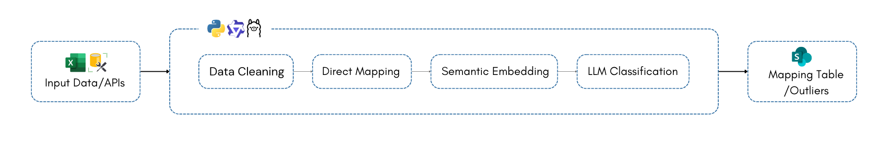

# Data-Cleaning-BCMDG

## Introduction

Ce projet automatise le nettoyage et la standardisation des données de différents endpoints connectés aux banques primaires.
L'objectif est de normaliser les champs clés vers des standards internationaux reconnus (ISO 4217, ISO 3166-1, SWIFT MT/MX, etc.), afin de garantir la cohérence, la qualité et l'exploitabilité des données pour le reporting et la supervision bancaire.

Comme illustré ci-dessous, chaque pipeline prend en entrée une extraction de données ou l'historique complet d'un endpoint depuis la base SQL Server `DATAWAREHOUSE_SA_PROD`, puis les fait passer par un workflow générique de nettoyage, mapping et classification. En sortie, une **table de mapping** référence toutes les valeurs reconnues vers leur modalité standardisée, et une **table des outliers** recense les valeurs non identifiées avec leurs statistiques par banque.

<p align="center">
  
</p>

---

## Pipelines

### Devise
Normalise le champ `Devise` vers le code **ISO 4217 alpha-3** (ex : `USD`, `EUR`, `MRU`).
Présent dans : **E07_FS**, **E08_OCD**, **E09_PE**, **E10_FE**, **E11_RDCC**.

### Pays
Normalise le champ `Pays` vers le code **ISO 3166-1 alpha-2** (ex : `FR`, `MA`, `MR`).
Présent dans : **E07_FS**, **E08_OCD**, **E10_FE**.

### TypeSwift
Normalise le champ `TypeSwfit` vers les codes **SWIFT MT** et **ISO 20022** (ex : `MT 103`, `pacs.008`).
Les codes valides sont séparés par flux (FS / FE) — validés avec l'équipe BCM le 30/03/2026.
Présent dans : **E07_FS** (flux sortants), **E10_FE** (flux entrants).

### ModeReglement
Normalise le champ `ModeReglement` vers les codes internes BCM (ex : `CD`, `RD`, `TL`).
Présent dans : **E07_FS**.

---

## Architecture

```
Data-Cleaning-BCMDG/
│
├── shared/                        Modules partagés par tous les pipelines
│   ├── config_base.yaml           Config commune (DB, LLM, format output)
│   ├── db_connector.py            Connexion SQL Server + lecture CSV/Excel
│   ├── build_tables.py            build_tables() + apply_na_rule()
│   ├── writer.py                  write_csv() + write_excel_sheets()
│   ├── ollama_client.py           Client LLM Ollama local
│   └── base_pipeline.py           BasePipeline + CLI commun (run_api / run_all)
│
├── devise/
│   ├── normalize_devise.py
│   ├── pipeline_devise.py
│   ├── referentiel/devise_referentiel.json
│   └── config/  E07_FS  E08_OCD  E09_PE  E10_FE  E11_RDCC .yaml
│
├── pays/
│   ├── normalize_pays.py
│   ├── pipeline_pays.py
│   ├── referentiel/pays_addr_keywords.json
│   └── config/  E07_FS  E08_OCD  E10_FE .yaml
│
├── typeswift/
│   ├── normalize_typeswift.py
│   ├── pipeline_typeswift.py
│   ├── referentiel/typeswift_referentiel.json
│   └── config/  E07_FS  E10_FE .yaml
│
├── mode_reglement/
│   ├── normalize_mode_reglement.py
│   ├── pipeline_mode_reglement.py
│   ├── referentiel/mode_reglement_referentiel.json
│   └── config/  E07_FS .yaml
│
├── .env.example
├── .gitignore
├── requirements.txt
└── README.md
```

---

## Installation

**Prérequis :**
- Python 3.10+
- Accès réseau à la base SQL Server BCM (`172.16.50.100:1433`)
- [Ollama](https://ollama.com) installé localement avec le modèle `qwen2.5:14b` (pipeline Pays uniquement)
- Bibliothèques listées dans `requirements.txt`

**Étapes :**

```bash
# 1. Cloner le dépôt
git clone https://github.com/BCM/Data-Cleaning-BCMDG.git
cd Data-Cleaning-BCMDG

# 2. Installer les dépendances
pip install -r requirements.txt

# 3. Configurer les credentials
cp .env.example .env
# Ouvrir .env et renseigner les valeurs de connexion à la base de données
```

Contenu de `.env` :
```
DB_USER=data_user
DB_PASSWORD=VOTRE_MOT_DE_PASSE
DB_HOST=172.16.50.100
DB_PORT=1433
DB_NAME=DATAWAREHOUSE_SA_PROD
DB_DRIVER=ODBC Driver 17 for SQL Server
```

---

## Utilisation

> Toutes les commandes sont à lancer depuis la racine `Data-Cleaning-BCMDG/`.

### Lancer un pipeline sur une API (depuis SQL Server)

Les fichiers générés portent automatiquement le tag `-historique-` dans leur nom.

```bash
python devise/pipeline_devise.py       --config devise/config/E07_FS.yaml
python devise/pipeline_devise.py       --config devise/config/E09_PE.yaml
python pays/pipeline_pays.py           --config pays/config/E10_FE.yaml
python typeswift/pipeline_typeswift.py --config typeswift/config/E07_FS.yaml
python mode_reglement/pipeline_mode_reglement.py --config mode_reglement/config/E07_FS.yaml
```

### Lancer avec un fichier local (CSV ou Excel)

```bash
python devise/pipeline_devise.py --config devise/config/E07_FS.yaml --input data/extract.csv
python pays/pipeline_pays.py     --config pays/config/E10_FE.yaml   --input data/extract.xlsx
```

### Lancer toutes les APIs d'un pipeline en parallèle

`--config-dir` est obligatoire depuis la racine du projet (le défaut `config/` ne correspondrait à aucun dossier).

```bash
python devise/pipeline_devise.py       --all --config-dir devise/config/
python pays/pipeline_pays.py           --all --config-dir pays/config/
python typeswift/pipeline_typeswift.py --all --config-dir typeswift/config/
```

---

## Outputs

Pour chaque exécution, deux fichiers sont générés dans `{pipeline}/outputs/{API}/` :

| Fichier | Contenu |
|---------|---------|
| `{API}-historique-extraction_{timestamp}.csv` | Extraction complète + colonne normalisée insérée juste après la colonne source |
| `{API}-historique-mapping_outliers_{timestamp}.xlsx` | Onglet **Mapping_Clean** (valeurs brutes → codes normalisés) + onglet **Analyse_Outliers** (statistiques OUTLIER par banque) |

Le tag `-historique-` est ajouté automatiquement si la source est SQL Server. Si la source est un fichier local (`--input`), le tag est absent.
